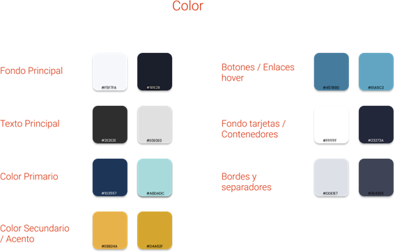

<h2 style="text-align:center;">Universidad Peruana de Ciencias Aplicadas</h2>
<h2 style="text-align:center;">Ingeniería de Software</h2>
<h2 style="text-align:center;">Ciclo 2025 - 1 </h2>

  

<h2 style="text-align:center;">1ASI0729 - Desarrollo de Aplicaciones Open Source</h2>
<h2 style="text-align:center;">Sección - 4341</h2>
<h2 style="text-align:center;">Docente: Juan Antonio Flores Moroco</h2>
<h2 style="text-align:center;">"Informe de Trabajo Final"</h2>
<h2 style="text-align:center;">Startup: CloseSource</h2>
<h2 style="text-align:center;">Producto: MatchEvent</h2>
<h2 style="text-align:center;">Integrantes:</h2>
<h3 style="text-align:center;">Aaron Alexander Avila Palacios</h3>
<h3 style="text-align:center;">Gabriel Anthony Braithuaite Toledo - u20201e889</h3>
<h3 style="text-align:center;">Kevin Alexander Castañeda Llanos</h3>
<h3 style="text-align:center;">Ivan Jeanpierre La Madrid Lozano</h3>
<h3 style="text-align:center;">Max Anthony Paitan Pumacahua</h3>
<h2 style="text-align:center;">2025</h2>

## Registro de Versiones del Informe
| Versión | Fecha    | Autor                      | Descripción de modificación |
|---------|----------|----------------------------|-----------------------------|
| 1.0     | 2025-04-16 | Gabriel Braithuaite Toledo| ejemplo                     |
| 1.0     | 2025-04- | Aaron Avila Palacios       | ejemplo                     |
| 1.0     | 2025-04- | Kevin Castañeda Llanos     | ejemplo                     |
| 1.0     | 2025-04- | Ivan La Madrid Lozano      | ejemplo                     |
| 1.0     | 2025-04- | Max Paitan Pamacahua       | ejemplo                     |
## Project Report Collaboration Insights
URL del repositorio de la Organizacion: https://github.com/UPC-PRE-SI729-2510-4341-G2-CloseSource
## Contenido
### Tabla de Contenido
- [**Registro de Versiones del Informe**](#registro-de-versiones-del-informe)
- [**Project Report Collaboration Insights**](#project-report-collaboration-insights)
- [**Contenido**](#contenido)
    - [Tabla de contenidos](#tabla-de-contenidos)
- [**Student Outcome**](#student-outcome)
- [ **Capítulo I: Introducción** ](#-capítulo-i-introducción-)
    - [**1.1. Startup Profile**](#11-startup-profile)
        - [**1.1.1. Descripción de la Startup**](#111-descripción-de-la-startup)
        - [**1.1.2. Perfiles de integrantes del equipo**](#112-perfiles-de-integrantes-del-equipo)
    - [**1.2. Solution Profile**](#12-solution-profile)
        - [**1.2.1 Antecedentes y problemática**](#121-antecedentes-y-problemática)
        - [What (¿Qué?)](#what-qué)
        - [Who (¿Quién?)](#who-quién)
        - [Where (¿Dónde?)](#where-dónde)
        - [When (¿Cuándo?)](#when-cuándo)
        - [Why (¿Por qué?)](#why-por-qué)
        - [How (¿Cómo?)](#how-cómo)
        - [How much (¿Cuánto?)](#how-much-cuánto)
        - [**1.2.2 Lean UX Process**](#122-lean-ux-process)
        - [**1.2.2.1. Lean UX Problem Statements**](#1221-lean-ux-problem-statements)
        - [**1.2.2.2. Lean UX Assumptions**](#1222-lean-ux-assumptions)
        - [**1.2.2.3. Lean UX Hypothesis Statements**](#1223-lean-ux-hypothesis-statements)
        - [**1.2.2.4. Lean UX Canvas**](#1224-lean-ux-canvas)
    - [**1.3. Segmentos objetivo**](#13-segmentos-objetivo)
- [ **Capítulo II: Requirements Elicitation \& Analysis**](#-capítulo-ii-requirements-elicitation--analysis)
    - [**2.1. Competidores**](#21-competidores)
        - [**2.1.1. Análisis competitivo**](#211-análisis-competitivo)
        - [**2.1.2. Estrategias y tácticas frente a competidores**](#212-estrategias-y-tácticas-frente-a-competidores)
    - [**2.2. Entrevistas**](#22-entrevistas)
        - [**2.2.1. Diseño de entrevistas**](#221-diseño-de-entrevistas)
        - [**2.2.2. Registro de entrevistas**](#222-registro-de-entrevistas)
        - [**2.2.3. Análisis de entrevistas**](#223-análisis-de-entrevistas)
    - [**2.3. Needfinding**](#23-needfinding)
        - [**2.3.1. User Personas**](#231-user-personas)
        - [**2.3.2. User Task Matrix**](#232-user-task-matrix)
        - [**2.3.3. User Journey Mapping**](#233-user-journey-mapping)
        - [**2.3.4. Empathy Mapping**](#234-empathy-mapping)
        - [**2.3.5. As-is Scenario Mapping**](#235-as-is-scenario-mapping)
    - [**2.4. Ubiquitous Language**](#24-ubiquitous-language)
- [ **Capítulo III: Requirements Specification**](#-capítulo-iii-requirements-specification)
    - [**3.1. To-Be Scenario Mapping**](#31-to-be-scenario-mapping)
    - [**3.2. User Stories**](#32-user-stories)
    - [**3.3. Impact Mapping**](#33-impact-mapping)
    - [**3.4. Product Backlog**](#34-product-backlog)
- [**Capítulo IV: Product Design**](#capítulo-iv-product-design)
    - [**4.1. Style Guidelines**](#41-style-guidelines)
        - [**4.1.1. General Style Guidelines**](#411-general-style-guidelines)
        - [**4.1.2. Web Style Guidelines**](#412-web-style-guidelines)
    - [**4.2. Information Architecture**](#42-information-architecture)
        - [**4.2.1. Organization Systems**](#421-organization-systems)
        - [**4.2.2. Labeling Systems**](#422-labeling-systems)
        - [**4.2.3. SEO Tags and Meta Tags**](#423-seo-tags-and-meta-tags)
        - [**4.2.4. Searching Systems**](#424-searching-systems)
        - [**4.2.5. Navigation Systems**](#425-navigation-systems)
    - [**4.3. Landing Page UI Design**](#43-landing-page-ui-design)
        - [**4.3.1. Landing Page Wireframe**](#431-landing-page-wireframe)
        - [**4.3.2. Landing Page Mock-up**](#432-landing-page-mock-up)
    - [**4.4. Web Applications UX/UI Design**](#44-web-applications-uxui-design)
        - [**4.4.1. Web Applications Wireframes**](#441-web-applications-wireframes)
        - [**4.4.2. Web Applications Wireflow Diagrams**](#442-web-applications-wireflow-diagrams)
        - [**4.4.3. Web Applications Mock-ups**](#443-web-applications-mock-ups)
        - [**4.4.4. Web Applications User Flow Diagrams**](#444-web-applications-user-flow-diagrams)
    - [**4.5. Web Applications Prototyping**](#45-web-applications-prototyping)
    - [**4.6. Domain-Driven Software Architecture**](#46-domain-driven-software-architecture)
        - [**4.6.1. Software Architecture Context Diagram**](#461-software-architecture-context-diagram)
        - [**4.6.2. Software Architecture Container Diagrams**](#462-software-architecture-container-diagrams)
        - [**4.6.3. Software Architecture Components Diagrams**](#463-software-architecture-components-diagrams)
    - [**4.7. Software Object-Oriented Design**](#47-software-object-oriented-design)
        - [**4.7.1. Class Diagrams**](#471-class-diagrams)
        - [**4.7.2. Class Dictionary**](#472-class-dictionary)
    - [**4.8. Database Design**](#48-database-design)
        - [**4.8.1. Database Diagram**](#481-database-diagram)
- [**Capítulo V: Product Implementation, Validation \& Deployment**](#capítulo-v-product-implementation-validation--deployment)
    - [**5.1. Software Configuration Management**](#51-software-configuration-management)
        - [**5.1.1. Software Development Environment Configuration**](#511-software-development-environment-configuration)
        - [**5.1.2. Source Code Management**](#512-source-code-management)
        - [**5.1.3. Source Code Style Guide \& Conventions**](#513-source-code-style-guide--conventions)
        - [**5.1.4. Software Deployment Configuration**](#514-software-deployment-configuration)
    - [**5.2. Landing Page, Services \& Applications Implementation**](#52-landing-page-services--applications-implementation)
        - [**5.2.1. Sprint 1**](#521-sprint-1)
            - [**5.2.1.1. Sprint Planning 1**](#5211-sprint-planning-1)
            - [**5.2.1.2. Sprint Backlog 1**](#5212-sprint-backlog-1)
            - [**5.2.1.3. Development Evidence for Sprint Review**](#5213-development-evidence-for-sprint-review)
            - [**5.2.1.4. Testing Suite Evidence for Sprint Review**](#5214-testing-suite-evidence-for-sprint-review)
            - [**5.2.1.5. Execution Evidence for Sprint Review**](#5215-execution-evidence-for-sprint-review)
            - [**5.2.1.6. Services Documentation Evidence for Sprint Review**](#5216-services-documentation-evidence-for-sprint-review)
            - [**5.2.1.7. Software Deployment Evidence for Sprint Review**](#5217-software-deployment-evidence-for-sprint-review)
            - [**5.2.1.8. Team Collaboration Insights during Sprint**](#5218-team-collaboration-insights-during-sprint)
        - [**5.2.2. Sprint 2**](#522-sprint-2)
            - [**5.2.2.1. Sprint Planning 2**](#5221-sprint-planning-2)
            - [**5.2.2.2. Sprint Backlog 2**](#5222-sprint-backlog-2)
            - [**5.2.2.3. Development Evidence for Sprint Review**](#5223-development-evidence-for-sprint-review)
            - [**5.2.2.4. Testing Suite Evidence for Sprint Review**](#5224-testing-suite-evidence-for-sprint-review)
            - [**5.2.2.5. Execution Evidence for Sprint Review**](#5225-execution-evidence-for-sprint-review)
            - [**5.2.2.6. Services Documentation Evidence for Sprint Review**](#5226-services-documentation-evidence-for-sprint-review)
            - [**5.2.2.7. Software Deployment Evidence for Sprint Review**](#5227-software-deployment-evidence-for-sprint-review)
            - [**5.2.2.8. Team Collaboration Insights during Sprint**](#5228-team-collaboration-insights-during-sprint)
        - [**5.2.3. Sprint 3**](#523-sprint-3)
            - [**5.2.3.1. Sprint Planning 3**](#5231-sprint-planning-3)
            - [**5.2.3.2. Sprint Backlog 3**](#5232-sprint-backlog-3)
            - [**5.2.3.3. Development Evidence for Sprint Review**](#5233-development-evidence-for-sprint-review)
            - [**5.2.3.4. Testing Suite Evidence for Sprint Review**](#5234-testing-suite-evidence-for-sprint-review)
            - [**5.2.3.5. Execution Evidence for Sprint Review**](#5235-execution-evidence-for-sprint-review)
            - [**5.2.3.6. Services Documentation Evidence for Sprint Review**](#5236-services-documentation-evidence-for-sprint-review)
            - [**5.2.3.7. Software Deployment Evidence for Sprint Review**](#5237-software-deployment-evidence-for-sprint-review)
            - [**5.2.3.8. Team Collaboration Insights during Sprint**](#5238-team-collaboration-insights-during-sprint)
        - [**5.2.4. Sprint 4**](#524-sprint-4)
            - [**5.2.4.1. Sprint Planning 4**](#5241-sprint-planning-4)
            - [**5.2.4.2. Sprint Backlog 4**](#5242-sprint-backlog-4)
            - [**5.2.4.3. Development Evidence for Sprint Review**](#5243-development-evidence-for-sprint-review)
            - [**5.2.4.4. Testing Suite Evidence for Sprint Review**](#5244-testing-suite-evidence-for-sprint-review)
            - [**5.2.4.5. Execution Evidence for Sprint Review**](#5245-execution-evidence-for-sprint-review)
            - [**5.2.4.6. Services Documentation Evidence for Sprint Review**](#5246-services-documentation-evidence-for-sprint-review)
            - [**5.2.4.7. Software Deployment Evidence for Sprint Review**](#5247-software-deployment-evidence-for-sprint-review)
            - [**5.2.4.8. Team Collaboration Insights during Sprint**](#5248-team-collaboration-insights-during-sprint)
    - [**5.3. Validation Interviews**](#53-validation-interviews)
        - [**5.3.1. Diseño de Entrevistas**](#531-diseño-de-entrevistas)
        - [**5.3.2. Registro de Entrevistas**](#532-registro-de-entrevistas)
        - [**5.3.3. Evaluaciones según heurísticas**](#533-evaluaciones-según-heurísticas)
    - [**5.4. Video About-the-Product**](#54-video-about-the-product)
- [**Conclusiones**](#conclusiones)
- [**Conclusiones y recomendaciones**](#conclusiones-y-recomendaciones)
- [**Video About-the-Team**](#video-about-the-team)
- [**Bibliografía**](#bibliografía)
- [**Anexos**](#anexos)

## Student Outcome

| Criterio Específico | Acciones Realizadas                                                                                                     | Conclusiones           |
|---------------------|-------------------------------------------------------------------------------------------------------------------------|------------------------|
|Comunica oralmente con efectividad a diferentes rangos de audiencia.| Gabriel Braithuaite - TB1  Kevin Castañeda - TB1  Aaron Avila - TB1  Max Paitan - TB1  Ivan La Madrid - TB1 | Se logró comunicar ... |
|Comunica por escrito con efectividad a diferentes rangos de audiencia.| Gabriel Braithuaite - TB1  Kevin Castañeda - TB1  Aaron Avila - TB1  Max Paitan - TB1  Ivan La Madrid - TB1 | Se logró comunicar ... |

# Capítulo 1: Introducción

## **1.1. Startup Profile**

El concepto de startup hace referencia a pequeñas o medianas empresas emergentes que ingresan al mercado impulsadas por propuestas tecnológicas, con un alto potencial de crecimiento. Estas empresas se caracterizan por su capacidad de escalar rápidamente y expandirse de manera eficiente. Además, suelen originarse con el objetivo de ofrecer soluciones claras, creativas y sencillas a problemas sociales relevantes.

### **1.1.1. Descripción de la Startup**

#### **Descripción de la empresa:**

Somos un grupo de estudiantes de la Universidad Peruana de Ciencias Aplicadas (UPC) los que formamos CloseSource, una organización que apuesta por el desarrollo de soluciones tecnológicas enfocadas en resolver problemas concretos del mercado. Como parte de este enfoque, se ha planteado el diseño y desarrollo de un aplicativo web orientado al sector del marketing experiencial.

El producto, denominado MatchEvent, busca explorar una problemática latente: la dificultad que enfrentan muchas marcas al intentar organizar activaciones de marketing efectivas. Las activaciones requieren coordinación, creatividad, logística y, sobre todo, proveedores confiables. Sin embargo, el proceso actual suele depender de contactos informales, referencias dispersas y gestiones manuales que pueden comprometer la calidad del resultado final.

A su vez, muchas productoras —especializadas en ejecutar eventos y activaciones— cuentan con la capacidad técnica y creativa para asumir estos retos, pero no siempre tienen acceso a nuevas oportunidades de negocio ni a canales digitales donde puedan mostrar su trabajo, recibir solicitudes o hacer propuestas de manera eficiente. Por ello, MatchEvent se concibe como una plataforma que intermedie entre estos dos actores. 

##### **Misión:**

Facilitar y hacer más eficiente el proceso de búsqueda, contacto y contratación de servicios de activación de marca, mediante una plataforma digital que conecte a empresas con productoras especializadas, promoviendo la transparencia, la calidad y la innovación en cada colaboración.

##### **Visión:**

Convertirnos en la plataforma líder en Perú para la gestión de activaciones de marca, siendo reconocidos por impulsar conexiones estratégicas entre empresas y productoras, y por contribuir al desarrollo del sector marketing a través del uso de soluciones tecnológicas innovadoras. 

### **1.1.2. Perfiles de integrantes del equipo**

####  Nombre: Avila Palacios, Aaron Alexander | U201823654

#### Nombre: Braithuaite Toledo, Gabriel Anthony | U20201e889

####  Nombre: Castañeda Llanos, Kevin Alexander | U202318814

####  Nombre: La Madrid Lozano, Ivan Jeanpierre | UU202113432

####  Nombre: Paitan Pumacahua, Max Anthony | U201314454

## **1.2. Solution Profile**

### **1.2.1 Antecedentes y problemática**

El marketing experiencial ha evolucionado como una estrategia clave para conectar emocionalmente con los consumidores, ofreciendo experiencias memorables que van más allá de la simple transacción comercial. Según Moser (2012), las estrategias de marketing experiencial aplicadas en espacios de retail buscan transformar la experiencia de compra en algo placentero y estimulante, generando un valor añadido para las marcas en un entorno altamente competitivo. ​

En el contexto peruano, Bardales y Herrera (2017) proponen un modelo de gestión basado en el marketing experiencial para fortalecer el valor de marca (Brand Equity). Su estudio destaca la importancia de generar experiencias únicas que permitan a las marcas construir relaciones sostenibles con los consumidores, especialmente en un mercado tan competitivo como el peruano. ​

Asimismo, Verhelst Moreno (2020) analiza la evolución del marketing experiencial desde sus principales exponentes, destacando cómo las experiencias sensoriales, emocionales y cognitivas influyen en la percepción y lealtad hacia una marca. Este enfoque resalta la necesidad de diseñar estrategias que involucren activamente al consumidor, creando vínculos más profundos y duraderos.

En el siguiente punto, vamos a realizar la investigación a detalle el problema. 

**What?**

* ¿Qué problema hay?
  
  Actualmente, muchas empresas que desean realizar activaciones de marca enfrentan dificultades para encontrar proveedores confiables que se ajusten a sus necesidades específicas. Este proceso suele depender de contactos informales, referencias poco verificables y una gestión manual que puede ser ineficiente y poco transparente. Al mismo tiempo, productoras con amplia capacidad para ejecutar este tipo de eventos no siempre tienen acceso a un canal que les permita captar nuevos clientes de manera estructurada ni mostrar adecuadamente su portafolio de servicios.

**When?**

* ¿Cuándo sucede el problema?
  
  Este problema es constante y ocurre cada vez que una empresa necesita lanzar una campaña de marketing que implique una experiencia directa con el consumidor, como ferias, activaciones en centros comerciales, eventos callejeros, entre otros. La necesidad se intensifica durante temporadas clave como campañas estacionales, lanzamientos de productos o fechas festivas.

* ¿Cuándo el cliente necesita el producto?
  
  Las empresas necesitan el sistema en las etapas iniciales de planificación de sus campañas de marketing, cuando buscan proveedores y elaboran presupuestos. Las productoras lo necesitan para recibir oportunidades y organizar sus propuestas y operaciones con antelación.

**Where?**

* ¿Dónde el cliente usará el producto?
  
  El producto será utilizado en contextos urbanos, principalmente en ciudades como Lima, donde existe una alta concentración de marcas, agencias y productoras. La plataforma estará disponible de manera web, por lo que podrá ser usada desde computadoras o dispositivos móviles por parte de las empresas y productoras, tanto desde oficinas como desde cualquier lugar con conexión a internet.

**Why?**

* ¿Por qué se genera el producto?
  
  La plataforma se crea para resolver una necesidad real de conexión entre dos actores clave del ecosistema de marketing: las empresas que buscan ejecutar campañas de alto impacto y las productoras que pueden llevarlas a cabo. Se busca brindar una solución más eficiente, digitalizada y transparente, que elimine fricciones y fomente relaciones comerciales más fluidas y confiables.

**Who?**

* ¿Quién usará el producto?
  
  **Empresas o marcas**: Usuarios que buscan realizar activaciones de marca y necesitan contactar productoras para recibir propuestas, cotizaciones o contratar servicios de producción de eventos.
  
  **Productoras especializadas**: Empresas o equipos de producción que ofrecen servicios relacionados a la ejecución de activaciones y eventos de marca, y que desean expandir su base de clientes o mejorar su visibilidad en el mercado.

**How?**

* ¿Cómo se usará?
  El aplicativo web permitirá a las empresas registrarse, publicar una solicitud con detalles de la activación que desean realizar (tipo de evento, ubicación, fechas, presupuesto estimado), y recibir propuestas de diferentes productoras interesadas. Las productoras, por su parte, podrán crear un perfil con su información, portafolio de servicios, casos anteriores y calificaciones. A partir de allí, podrán postularse a proyectos, enviar cotizaciones y comunicarse con los clientes directamente a través de la plataforma.
  
  Principales funcionalidades:

  - Registro de empresas y productoras.

  - Publicación de requerimientos por parte de las empresas.

  - Postulación de productoras con propuestas personalizadas.

  - Sistema de mensajería y seguimiento de propuestas.

  - Historial de contrataciones y sistema de calificación.

**How much?**

* ¿Cuánto costará?
  
  El modelo económico está en etapa de diseño, pero se proyecta que la plataforma funcione bajo un esquema freemium para las productoras (registro gratuito, con posibles comisiones por proyecto adjudicado o acceso a funciones premium). Para las empresas, el acceso básico sería gratuito, con posibles planes para funciones avanzadas como soporte personalizado o gestión de múltiples proyectos simultáneos.

### **1.2.2 Lean UX Process.**  
	  
#### **1.2.2.1. Lean UX Problem Statements.**  
	  
**Problem Statement 1: Empresas que necesitan realizar activaciones de marca**

MatchEvent es una plataforma web diseñada para conectar a empresas interesadas en ejecutar campañas de activación de marca con productoras que pueden hacerlas realidad. La propuesta de valor está enfocada en facilitar el acceso a proveedores confiables, comparar propuestas y agilizar el proceso de contratación para campañas publicitarias o eventos promocionales.

Hemos identificado una dificultad importante que enfrentan las empresas al intentar ejecutar estrategias de marketing experiencial.

**Problema:**  

Las empresas tienen problemas para encontrar productoras adecuadas para sus activaciones, debido a la informalidad en el proceso de búsqueda, falta de referencias verificadas, dificultad para comparar presupuestos, y poca visibilidad del portafolio de las productoras. Esto genera retrasos, riesgos de mala ejecución y un mayor costo operativo.

**Pregunta central:**  

¿Cómo podríamos ayudar a las empresas a encontrar y contratar productoras confiables de forma más rápida, transparente y eficiente, asegurando una mejor ejecución de sus activaciones de marca?

**Problem Statement 2: Productoras de activaciones y eventos**

MatchEvent también busca empoderar a las productoras brindándoles un canal formal y digital para captar nuevos clientes, mostrar su experiencia y competir de manera justa por oportunidades en el mercado de eventos y activaciones.

Hemos detectado una necesidad relevante en este segmento en relación con su visibilidad y gestión de propuestas comerciales.

**Problema:**  
Las productoras tienen dificultades para acceder a clientes fuera de su red de contactos. Esto limita su crecimiento, ya que no pueden mostrar fácilmente su portafolio, ni competir con otras productoras en igualdad de condiciones. La falta de herramientas para gestionar propuestas y recibir solicitudes directas también dificulta su operación.

**Pregunta central:**  
¿Cómo podríamos brindar a las productoras una plataforma donde puedan aumentar su visibilidad, mostrar sus trabajos anteriores y recibir solicitudes de forma organizada, profesional y con mayor alcance?

# **Capítulo IV: Product Design**

## **4.1. Style Guidelines.**

### **4.1.1. General Style Guidelines.**

**Branding:**

Para el diseño del logotipo, se utilizaron los colores base de la paleta principal, buscando transmitir profesionalismo y confianza. Se incorporó un ícono relacionado con la organización de eventos para reforzar visualmente la esencia del servicio. La tipografía fue elegida por su legibilidad y estilo moderno, alineándose con la identidad tecnológica y formal del proyecto.

 

 

 

Hemos considerado diseñar el logotipo tanto para el modo claro y el modo oscuro, los cuales cuentan con los colores principales de cada modo.

**Colors:**

Dado que el proyecto está orientado a conectar empresas con productoras especializadas en activaciones de marca, se seleccionó una paleta de colores que refleje profesionalismo, dinamismo y confianza. Los tonos fueron elegidos cuidadosamente para mantener una estética formal, moderna y funcional tanto en modo claro como en modo oscuro, asegurando una experiencia visual agradable y coherente en el aplicativo web.

En el modo claro, predominan tonos suaves como el gris muy claro (#F5F7FA) y el blanco (#FFFFFF) para los fondos, lo que genera una sensación de limpieza y claridad. El azul profundo (#1D3557), como color primario, representa tecnología y seriedad, mientras que el mostaza suave (#E8B24A) aporta un toque moderno y distintivo sin saturar visualmente. Los acentos en celeste tenue (#457B9D) refuerzan la interacción del usuario, guiándolo sin ser invasivos.

Por otro lado, en el modo oscuro se utilizaron colores que brindan descanso visual, como el azul gris oscuro (#1B1E2B) para el fondo y el gris claro (#E0E0E0) para los textos. El azul suave (#A8DADC) conserva el enfoque tecnológico, pero adaptado a un entorno nocturno, y el mostaza apagado (#D4A62F) mantiene el equilibrio entre sobriedad y acento visual. Estos colores buscan asegurar una experiencia accesible, elegante y funcional en cualquier contexto de uso.

  
Además tenemos a los colores de estado, los cuales nos permiten comunicar situaciones clave dentro del sistema de forma visual e intuitiva. El rojo se utiliza para errores o alertas críticas, el verde indica acciones exitosas, el amarillo señala advertencias o validaciones pendientes, y el azul (opcional) puede emplearse para mensajes informativos.
Acompañan estos, los colores neutros como el blanco, el negro y los grises, que aportan equilibrio visual y ayudan a jerarquizar los contenidos sin distraer la atención del usuario
 

**Spacing:**

Se ha adoptado un sistema de espaciado modular basado en múltiplos de 4 píxeles (4px, 8px, 12px, 16px, 32px, etc.) con el fin de mantener una estructura visual limpia, ordenada y coherente en toda la interfaz. Esta decisión facilita la alineación precisa entre elementos, mejora la legibilidad del contenido y refuerza la jerarquía visual, permitiendo que la información fluya de forma natural. Al aplicar estas unidades de manera sistemática, se optimiza también la escalabilidad del diseño, haciendo que la interfaz pueda adaptarse fácilmente a diferentes tamaños de pantalla sin perder equilibrio ni armonía visual.

  

**Dimensions:**

Para las dimensiones dentro del proyecto, se ha definido un enfoque que prioriza tanto la accesibilidad como la experiencia de usuario. Los elementos interactivos clave, como botones o campos de formulario, cuentan con dimensiones generosas que facilitan su interacción, especialmente en dispositivos táctiles. Se busca que todos los componentes sean fácilmente identificables y utilizables, reduciendo errores y mejorando la eficiencia al navegar.

El diseño es completamente responsivo, lo que permite que los elementos se ajusten automáticamente al tamaño de pantalla del dispositivo utilizado, ya sea móvil, tablet o escritorio. Imágenes y contenedores mantienen proporciones flexibles para asegurar una correcta visualización sin distorsión. Además, se emplean puntos de quiebre estratégicos (breakpoints) que adaptan las dimensiones de la interfaz para mantener un equilibrio visual y funcional en todo momento.

**Typography:**

Para este proyecto se ha elegido la tipografía Roboto, una fuente sans-serif moderna, versátil y altamente legible que se adapta muy bien a entornos digitales. Su diseño limpio y neutral permite una lectura fluida tanto en pantallas grandes como en dispositivos móviles, lo que la convierte en una excelente opción para interfaces enfocadas en la usabilidad.

Se emplean distintos pesos tipográficos (regular, medium y bold) para jerarquizar correctamente la información y guiar la atención del usuario de forma clara y coherente. Los títulos utilizan un peso más fuerte y tamaños mayores para destacar las secciones importantes, mientras que los textos secundarios y descriptivos mantienen un peso ligero para evitar la sobrecarga visual.

Además, se ha cuidado el interlineado y el espaciado entre caracteres para asegurar una buena legibilidad, especialmente en bloques de texto extensos o formularios. La elección de Roboto no solo responde a una cuestión estética, sino también funcional: mejora la accesibilidad, es compatible con múltiples navegadores y dispositivos, y aporta una sensación profesional y contemporánea a toda la interfaz. 

### **4.1.2. Web Style Guidelines.**

**Buttons:** 

En el desarrollo del proyecto se utilizarán componentes de Angular Material para la implementación de los botones, lo que garantiza consistencia, accesibilidad y buenas prácticas en diseño UI. Los botones adoptarán un estilo con bordes ligeramente redondeados para transmitir una apariencia moderna y amigable, alineada con la estética general de la plataforma.

La paleta de colores personalizada se aplicará a los distintos estados y jerarquías de los botones: el color primario se usará para las acciones principales, mientras que el color secundario servirá de soporte en acciones complementarias. Además, se incluirán efectos de hover y focus con tonos suaves derivados de la paleta, mejorando la retroalimentación visual durante la interacción.

Se mantendrá una proporción adecuada entre tamaño de texto, padding y altura de los botones para asegurar que sean fácilmente clickeables, tanto en pantallas grandes como en dispositivos móviles. Este enfoque busca facilitar la navegación, guiar la acción del usuario y mantener la coherencia visual en toda la interfaz.

  

**Icons:** 

En el desarrollo de la plataforma se emplearán íconos del sistema Material Icons, integrados mediante Angular Material, lo que garantiza compatibilidad, accesibilidad y consistencia visual en toda la interfaz. Estos íconos siguen un estilo sencillo y geométrico, ideal para complementar un diseño limpio, moderno y funcional.

Se priorizará el uso de íconos que refuercen el significado de botones y acciones clave dentro de la aplicación, permitiendo al usuario identificar funcionalidades de forma intuitiva. Además, se adaptarán a la paleta de colores del sistema para mantener una coherencia estética, evitando distracciones o rupturas visuales dentro del flujo de navegación.

Su aplicación estará presente en áreas como navegación, formularios, estados del sistema y acciones secundarias, buscando siempre que los elementos visuales aporten valor informativo sin recargar la interfaz. Esto permitirá mejorar la experiencia de usuario mediante una comunicación visual clara y efectiva.

 

## **4.2. Information Architecture.**

### **4.2.1. Organization Systems.**  
Considerando que somos estudiantes, decidimos adoptar un formato jerárquico estándar, parecido al enfoque organizativo que podemos encontrar en gran cantidad de páginas web. Esto aplica para:

**Landing page**: Donde se presenta las principales características que tiene el aplicativo web, orientado a los dos segmentos objetivos. Este contará con una sección de inicio, Features, About us y Contact Us.

**Web Application**: Donde se brinda acceso a los dos segmentos objetivos, para que puedan buscar y generar contactos entre ambos, para el desarrollo de sus eventos/activaciones.

# Capítulo V: Product Implementation, Validation & Deployment.

## 5.1. Software Configuration Management.

### 5.1.1. Software Development Environment Configuration.

- **UXPRESSIA:** UXPressia es una plataforma especializada en la creación de herramientas visuales orientadas al diseño centrado en el usuario. Permite desarrollar mapas de experiencia del cliente, diagramas de flujo, mapas de sitio y otros recursos clave para entender y optimizar la interacción entre los usuarios y un producto o servicio. En nuestro proyecto, utilizaremos UXPressia para mapear la experiencia de los diferentes usuarios que interactúan con la plataforma, identificando sus necesidades, puntos de dolor y oportunidades de mejora.
  

- **Figma:** Figma es una herramienta de diseño colaborativo basada en la web, enfocada en la creación de interfaces gráficas y experiencias de usuario (UI/UX). Su entorno en línea permite que múltiples diseñadores trabajen simultáneamente en un mismo archivo, lo que mejora la colaboración en tiempo real. En el contexto de nuestro proyecto, usaremos Figma para diseñar las pantallas, los prototipos interactivos y la interfaz visual del producto, asegurando que cumpla con criterios de usabilidad y estética.

  
- **Miro:**  Miro es un tablero digital colaborativo que facilita la organización visual de ideas, flujos de trabajo, mapas mentales y diagramas. Se utiliza comúnmente en sesiones de brainstorming, planificación ágil, workshops y diseño de productos. Para nuestro proyecto, emplearemos Miro en las etapas iniciales para conceptualizar la estructura general, visualizar procesos, y organizar ideas clave entre los miembros del equipo. También lo usaremos para documentar decisiones importantes a lo largo del desarrollo.

#### Software Development

- **(IDE)s**

**Visuals Studio Code:** Se trata de un editor de texto multiplataforma y de código abierto creado por Microsoft, ampliamente utilizado en la comunidad de desarrollo. Soporta múltiples lenguajes de programación y cuenta con una gran cantidad de extensiones que facilitan y enriquecen el entorno de trabajo del programador. En el proyecto, utilizamos esta herramienta tanto para construir la landing page como para redactar la documentación en archivos con formato “.md”.

**WebStorm:** Es un entorno de desarrollo integrado (IDE) desarrollado por JetBrains, especialmente orientado al desarrollo frontend. Ofrece herramientas potentes y características inteligentes para trabajar eficientemente con tecnologías web como HTML, CSS y JavaScript, lo que facilita la creación y mantenimiento de interfaces dinámicas y modernas.

- **HTML5:** Es la quinta y más actualizada versión del lenguaje de marcado utilizado para estructurar el contenido en la web. Introduce nuevas etiquetas semánticas, soporte multimedia nativo y mejoras en la interoperabilidad con otras tecnologías web. Estas características lo convierten en una herramienta esencial para el desarrollo de sitios web modernos y responsivos.

- **CSS3:** Es la última evolución del lenguaje de hojas de estilo en cascada (Cascading Style Sheets), empleado para definir la apariencia visual de los sitios web. Incorpora funcionalidades avanzadas como animaciones, transiciones, gradientes y media queries, lo que permite crear interfaces más atractivas, dinámicas y adaptables a diferentes dispositivos. Es una pieza clave en el desarrollo de experiencias web modernas.

- **AngularJS:** Es un framework de desarrollo web basado en JavaScript y mantenido por Google, diseñado para facilitar la creación de aplicaciones de una sola página (SPA). Proporciona una arquitectura robusta que permite gestionar componentes reutilizables, el enrutamiento entre vistas, y la integración con servicios backend. Gracias a su enfoque modular y su sistema de enlace de datos, es ampliamente utilizado para construir interfaces interactivas y escalables.

- **JS:** JavaScript es un lenguaje de programación esencial en el desarrollo web, utilizado para dotar de interactividad y dinamismo a sitios y aplicaciones en línea. Permite manipular el contenido de la página en tiempo real, responder a acciones del usuario, validar formularios, y mucho más. Su versatilidad lo convierte en una herramienta clave tanto en el frontend como en el backend de aplicaciones modernas.

### 5.1.2. Source Code Management.

Creamos una organización en Github con todos los miembros del grupo, y dentro de esta creamos un repositorio para cada parte del proyecto, siendo:

| **Segmento** | **URL** |
|-----------|-----------| 
| Organización | https://github.com/UPC-PRE-SI729-2510-4341-G2-CloseSource| 
|Report|https://github.com/UPC-PRE-SI729-2510-4341-G2-CloseSource/Report| 
| Repositorio Landing Page| https://github.com/UPC-PRE-SI729-2510-4341-G2-CloseSource/Landing-Page | 
| Backend | https://github.com/UPC-PRE-SI729-2510-4341-G2-CloseSource/Backend |
| Frontend | https://github.com/UPC-PRE-SI729-2510-4341-G2-CloseSource/Frontend |

**GitFlow Implementation:**

GitFlow es una estrategia estructurada para el control de versiones en Git, que establece un flujo de trabajo claro mediante la organización de ramas. Bajo este modelo, la rama develop sirve como base para integrar nuevas funcionalidades en desarrollo, mientras que la rama main almacena la versión estable del proyecto, lista para ser desplegada, en este caso, a través de GitHub Pages. Además, se crean ramas específicas para cada funcionalidad o tarea (feature), lo cual permite trabajar de forma paralela y controlada, facilitando la colaboración y el mantenimiento del código. Por ello, lo convierte en la herramienta perfecta para que nosotros podamos gestionar y administrar el desarrollo de nuestro proyecto sin problemas.

**Feature Branches:**

Cada nueva característica se desarrolla en una rama separada, que se crea a partir de la rama develop. Estas ramas permiten mantener el trabajo en curso aislado, lo que facilita la integración de nuevas funcionalidades sin interrumpir el flujo principal de desarrollo.

### 5.1.3. Source Code Style Guide & Conventions.

En relación con las convenciones de programación, utilizaremos los estilos camelCase y UpperCamelCase según corresponda. También seguiremos las pautas de la "Guía de Estilo HTML/CSS de Google" para garantizar una codificación consistente en HTML y CSS.

Para el control de versiones, adoptaremos la metodología de "conventional commits" en la creación de ramas y en los mensajes de commit. Las ramas se nombrarán siguiendo el formato < type >/< title >, mientras que los mensajes de commit seguirán el patrón < type >(scope opcional):< descripción >. Algunos ejemplos serían:

    Rama: feat/main-component

    Commit: feat: content in profile added

Para el control de versiones relacionado con el Report, implementaremos una ligera variación:

    Rama: feature/capitulo1

    Commit: feat: final report structure implemented

En cuanto a la gestión de ramas, utilizaremos el modelo GitFlow. Esto implicará crear ramas de características (feature branches) con la nomenclatura establecida. La rama principal será main, donde se almacenará la versión estable y en producción de la aplicación. Las ramas de características y correcciones se fusionarán eventualmente con la rama main, mientras que, durante el proceso de desarrollo, se integrarán primero en la rama develop hasta que se logre la versión final.

### 5.1.4. Software Deployment Configuration.

## **5.2. Landing Page, Services & Applications Implementation**  
### **5.2.1. Sprint 1**  
#### **5.2.1.1. Sprint Planning 1**

| **Sprint #**                | 1                                  |
| :-------------------------: |------------------------------------|
| **Sprint Planning Background**                                     |
| **Date**                    | 12/04/2025                         |
| **Time**                    | 8:00 pm                            |
| **Location**                | Reunión virtual a través del canal de discord del equipo llamado “Team CloseSource” |
| **Prepared by**             | Max Anthony Paitan Pumacahua       |
| **Attendees (to planning meeting)** | Aaron Alexander Avila Palacios, Gabriel Anthony Braithuaite Toledo, Kevin Alexander Castañeda Llanos, Ivan Jeanpierre La Madrid Lozano, Max Anthony Paitan Pumacahua |
| **Sprint 1 Review Summary** | Completar el desarrollo del Report. Primer avance del Landing Page del proyecto |
| **Sprint 1 Retrospective Summary** | Se realizó la distribución de temas para completar la documentación, además de diseñar e implementar la primera versión de nuestro landing page |
| **Sprint Goal & User Stories**                                     |
| **Sprint 1 Goal**           | **Nos enfocamos** en diseñar y desarrollar la landing page de MatchEvent. **Creemos que** esto aportará una presentación clara y atractiva del propósito de la plataforma, generando confianza inicial en empresas y productoras interesadas en registrarse o conocer más sobre el servicio. **Esto se confirmará** cuando la landing page esté publicada, muestre la identidad visual del proyecto y comunique efectivamente cómo MatchEvent conecta a ambos segmentos de forma ágil y eficiente. |
| **Sprint n Velocity**       | 1 semana                           |
| **Sum of Story Points**     | 11                                 |

#### **5.2.1.2. Aspect Leaders and Collaborators**
| Team Member | GitHub username | Diseño de la UI del Landing Page | Programación de la sección "Inicio"  | Programación de la sección "Features" | Programación de la sección "About Us" | Programación de la sección "Contact Us" |
| :--: | :--: | :--: |:--: | :--: | :--: | :--: |
| Aaron Alexander Avila Palacios |  | - | - | - | - | - |
| Gabriel Anthony Braithuaite Toledo | Gaboo04 | -| - | -| -| -|
| Kevin Alexander Castañeda Llanos | KevCast1604 | -| -| -| - | - |
| Ivan Jeanpierre La Madrid Lozano |  | -| -| -| -| -|
| Max Anthony Paitan Pumacahua | MaxPaitanP | L | L | L | L | L |

#### **5.2.1.3. Sprint Backlog 1**

| Sprint \# | Sprint 1 |  |  |  |  |  |  |
| :---: | :---: | :---: | :---: | :---: | :---: | :---: | :---: |
| User Story |  | Work-Item / Task |  |  |  |  |  |
| ID  | Title | ID | Title | Description | Estimation (Hours) | Assigned To | Status |
| US | Sección Inicio	 | TS01 | Implementación de la sección Inicio | Correción de los botones de llamada a la acción en el Landing Page, configurándolo en el html y el css | 2 hours | Max | Done |
| US | Sección Features | TS02 | Implementación de la sección Features | Corrección de ciertos errores existentes en la característica responsive del Landing Page | 2 hours | Max | Done |
| US | Sección About Us | TS03 | Implementación de la sección About Us | Corrección de ciertos errores existentes en la característica responsive del Landing Page | 2 hours | Max | Done |
| US | Sección Contact Us | TS04 | Implementación de la sección Contact Us | Corrección de ciertos errores existentes en la característica responsive del Landing Page | 2 hours | Max | Done |

#### **5.2.1.4. Development Evidence for Sprint Review**

| Repository | Branch | Commit ID | Commit Message | Commit Message Body | Committed on date |
| :---: | :---: | :---: | :---: | ----- | :---: |
| CloseSource-Landing-Page | main | b318cf8c81c544963677622047e49954de843638 | Feature: Add files via upload | —---------- | 06/09/2024 |
| CloseSource-Landing-Page | main | 902341545a8caf4527f88f7910e26608dd61de21 | Feature: add images to the landing page folder | —---------- | 06/09/2024 |
| CloseSource-Landing-Page | main | 44599733a240bd6d2f6a537a0c2a21b22d2c5df6 | Feature: fix about-us image error | —---------- | 06/09/2024 |
| CloseSource-Landing-Page | main | ff568669c9926924b45928b3bfa7fcfd082115e1 | Feature: fix carousel images | —---------- | 06/09/2024 |
| CloseSource-Landing-Page | main | 816a16a246cc39876189df416d25bb264c1f54d9 | Feature: update html name | —---------- | 06/09/2024 |
| CloseSource-Landing-Page | main | 492d5df6a9a10645c7ea6494442a5d15e7ece482 | Feature: update landing page colors | —---------- | 07/09/2024 |
| CloseSource-Landing-Page | main | 525c63f7089ed0c900be749e74661962f5128cf4 | Feature: fix responsive images in about-us | —---------- | 07/09/2024 |
| CloseSource-Landing-Page | main | 413b5efa913beebbc9652d5f134d01edaa98e75c | Feature: add style to hamburger menu | —---------- | 07/09/2024 |

#### **5.2.1.5. Execution Evidence for Sprint Review** 

Link del video:

#### **5.2.1.6. Services Documentation Evidence for Sprint Review**

No se han implementado servicios para el Landing Page, por lo que no se tiene documentación de los servicios. Por otro lado, aún no hemos desarrollado los servicios para el aplicativo web, lo cual haremos en los siguientes sprints.

#### **5.2.1.7. Software Deployment Evidence for Sprint Review.**   
 

#### **5.2.1.8. Team Collaboration Insights during Sprint.** 

# Bibliografía:

Bardales, A., & Herrera, K. (2017). *Propuesta de modelo de gestión basado en el marketing experiencial para la generación de Brand Equity en el contexto peruano* (Tesis de licenciatura, Pontificia Universidad Católica del Perú). PUCP Repositorio Institucional. Recuperado de https://tesis.pucp.edu.pe/items/c66796b3-30b9-46b7-aae2-3c2ba015936a [Consulta: 16 de abril de 2025]

Moser, M. (2012). *Estrategias de marketing experiencial aplicadas al retail*. Universidad de San Andrés. Recuperado de https://repositorio.udesa.edu.ar/handle/10908/963 [Consulta: 16 de abril de 2025]

Verhelst, L. (2020). *Evolución del marketing experiencial desde la perspectiva de sus principales exponentes*. (Trabajo de grado, Pontificia Universidad Javeriana). Repositorio Institucional PUJ. Recuperado de https://repository.javeriana.edu.co/handle/10554/52760 [Consulta: 16 de abril de 2025]

